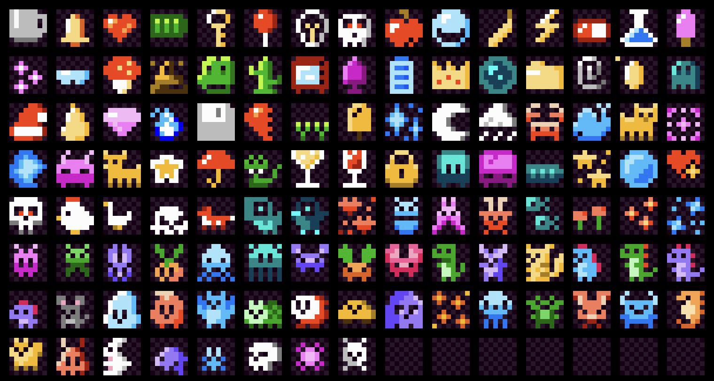

## Intro

Come create an art piece on a 8x8 pixel map canvas for TrustX Istanbul! Register as an individual or team, then start placing pixel colours!

## Contract Addresses (Sepolia)
- `X_IST`: [`0x148412086B279215e2F7feC41A912cBcE4B4c37f`](https://sepolia.etherscan.io/address/0x148412086B279215e2F7feC41A912cBcE4B4c37f#code)
- `PixelsMap`: [`0x5D98D16BCd69aEf78474a4591e1f50B6c6C55Ca7`](https://sepolia.etherscan.io/address/0x5D98D16BCd69aEf78474a4591e1f50B6c6C55Ca7#code)

## Telegram Group
Join the [Telegram Group](https://t.me/TrustXIstCodeClash) for QnAs & discussions!

## Actions (Basic Explanation)

### Registration
First, join a team by calling `register(uint16 teamNumber)`. Largest team number is 1000 (ie. max 1000 teams). Then, set the team name (minimum of 5 characters) if it isn't already set by other team members by calling `setTeamName(string teamName)`.

### Placing Pixels
Call `placePixels(uint8[] pixels, uint8[] colors, false, "")` where the pixels are the pixel(s) you'd like to draw on, with the corresponding color(s). Please refer to the [colour section](#Colours) for the available colors.

### Placing Mines
Mining a pixel entitles the miner to receive 2x X_IST payable by the next caller on that pixel. Call `placeMines(uint8[] pixels)` to place mines on specified pixels.

### Resetting Pixels
Resetting the pixel resets its data and refunds the caller, provided that you're the pixel's painter. This action is performed by calling `resetPixels()`.

## Actions (Technical Explanation)
Note that actions generally require X_IST tokens that's minted upon registration (subject to availability and rate limits).

### 1. `register()`
Registers caller, thereby receiving some pseudorandom amount of X_IST tokens. Mints equivalent amount to the `PixelsMap` contract.

### 2. `setTeamName()`
Register team name. Minimally 5 characters, immutable once set!

### 3. `placePixels()`
Initialise / replace pixel colour.

### 4. `placeMines()`
Mining a pixel entitles the miner to receive 2x X_IST payable by the next caller on that pixel.

### 5. `resetPixels()`
Resets and refunds a fixed amount of X_IST tokens.

### Note
Miner payments and refunds are subject to the available funds held by the `PixelsMap` contract

## Colours
16 colours in total for simplicity, stored as `uint8`. No validation on value stored, anything larger than 15 will default to white `#FFFFFF`.

| Value | Hexcode | Image |
|:------|:---------|:-:|
| `0` | `#FFFFFF` |  |
| `1` | `#F7E7CE` |  |
| `2` | `#E81416` |  |
| `3` | `#7B3F00` |  |
| `4` | `#FFA500` |  |
| `5` | `#F6C324` |  |
| `6` | `#FAEB36` |  |
| `7` | `#79C314` |  |
| `8` | `#228B22` |  |
| `9` | `#0476D0` |  |
| `10` | `#191970` |  |
| `11` | `#4B369D` |  |
| `12` | `#70369D` |  |
| `13` | `#FF69B4` |  |
| `14` | `#36454F` |  |
| `15` | `#000000` |  |

## Award Categories
- Banksy: Team that paints the most pixels. Banksy's iconic street art is known for its bold statements and visually striking designs. Channel your inner Banksy and make your mark on the digital canvas!
  
- Justin Sun: Wallet holding the most X_IST tokens. Just like Justin Sun's strategic moves in the crypto world, accumulate the most X_IST tokens to secure your place as a PixelWars champion. The more tokens, the brighter your pixel legacy!

- Samczsun: Most creative exploit. Samczsun is renowned for his prowess in uncovering vulnerabilities and exploits. Get creative with your pixel artistry and showcase the most imaginative exploit on the canvas. Unleash your ingenuity in the pixel realm!

## Build Framework
[Next.js](https://nextjs.org) + [Foundry](https://book.getfoundry.sh/) + [wagmi](https://wagmi.sh) project bootstrapped with [`create-wagmi`](https://github.com/wagmi-dev/wagmi/tree/main/packages/create-wagmi)

